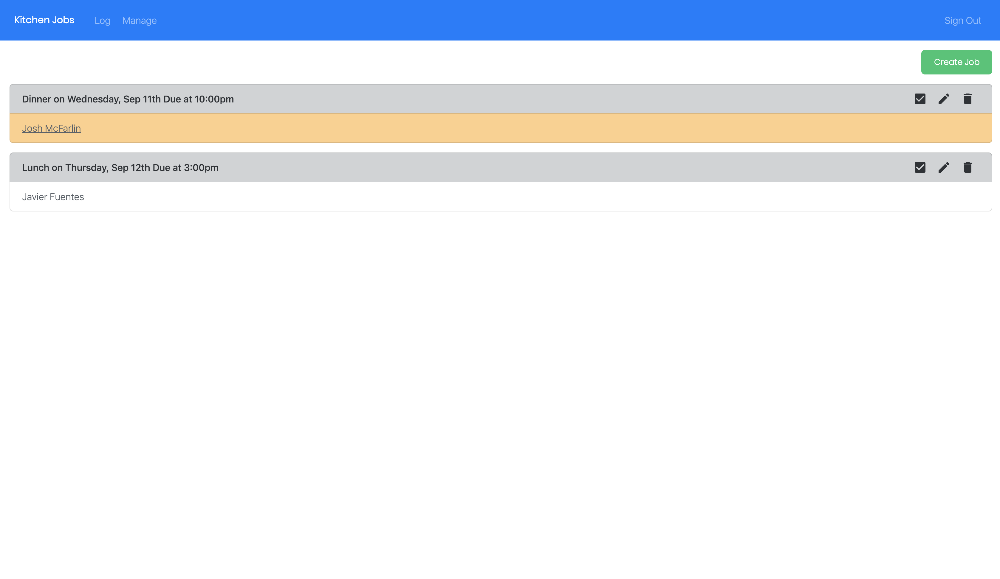
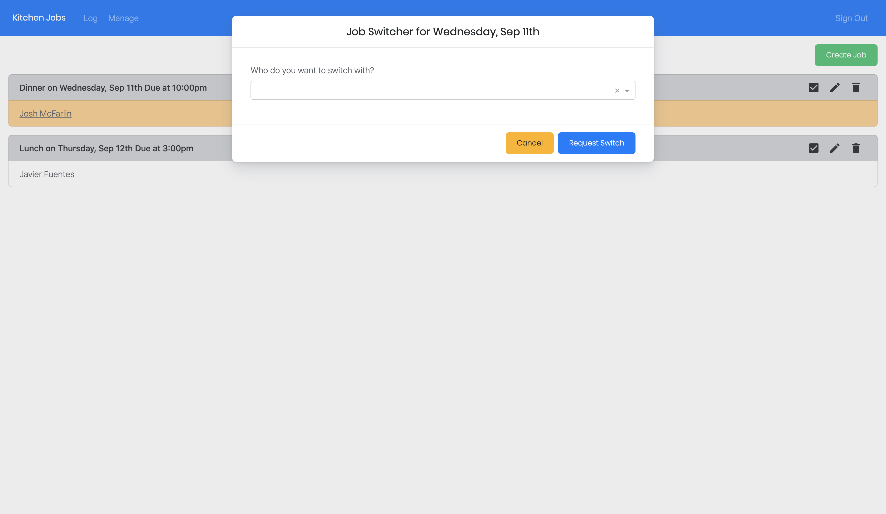
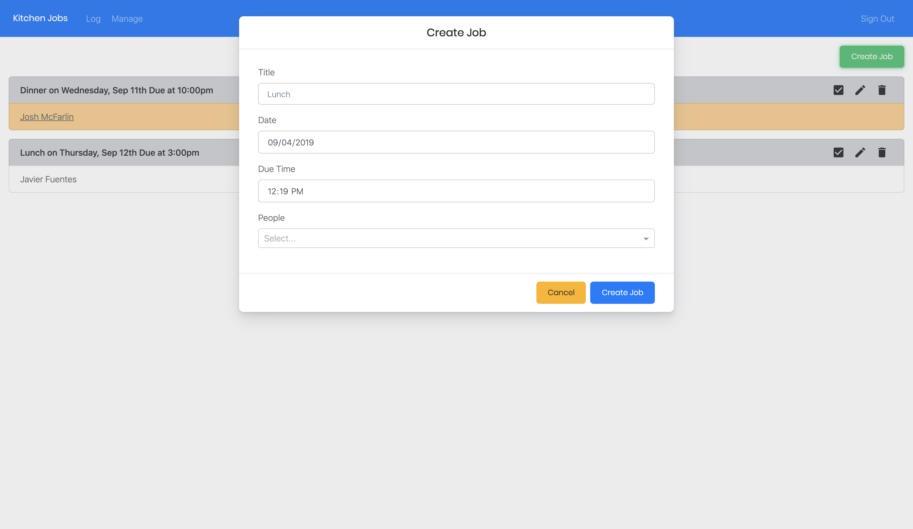
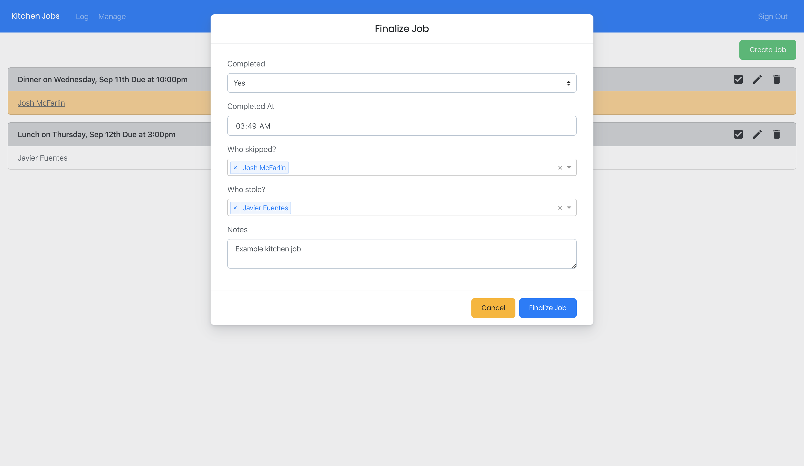
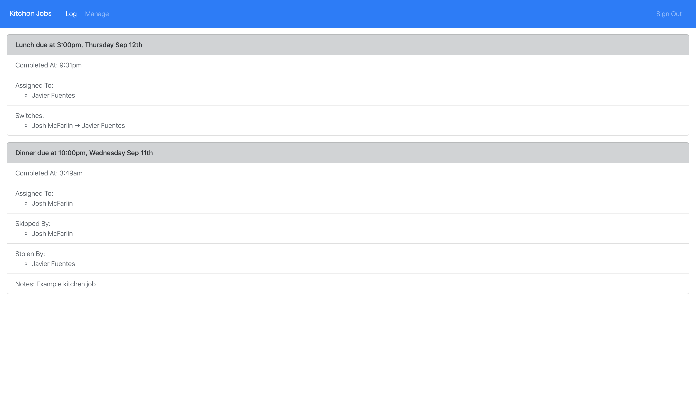

# kitchen-jobs
A tool to manage communal kitchen cleaning

## Why
* The best way to keep a communal kitchen clean is to assign cleaning jobs to each person who uses the kitchen.
* This is an easy tool for kitchen managers to create, manage, and log kitchen jobs in order to make the process as seamless as possible.
* However, sometimes last minute schedule changes prevent cleaners from doing their job. They should find someone to replace them, but it is difficult for kitchen managers to keep up with these changes.

## Tech Stack
* **React.js**: Front-end
* **Next.js**: Framework for using React with Server-Side Rendering, and providing internal API access
* **Firebase**: Authentication and database
* **SendGrid**: Email functionality

## Design Stack
* **Bootstrap**: For the base CSS
* **Shards React**: Expanded Bootstrap components and React implementation
* **react-jss**: For CSS-in-JS

## Screenshots and Functionality

* The home page lists all upcoming kitchen jobs.
* Managers are able to create, edit, finalize, and delete jobs.
* Regular users have their kitchen jobs highlighted, and clicking on them will open a dialog to switch with another person.

* Regular users are able to switch their kitchen job with someone else by selecting their name.
* After submitting the form, an email is sent to the person they selected. The email has details about the job, and a link to confirm the job change.
* They job switch will only be made if the selected person clicks the email link and confirms the request.

* When creating a job, managers are able to provide a title, date, and the time it is due at.
* A selector shows all people who have signed up to do kitchen jobs, and allows selecting multiple people.

* Managers are able to finalize a job to mark it as completed, along with the time and any notes.
* Someone who was assigned to the job, and did not do it and did not find someone to replace them is marked as skipped.
* Someone who decided to do the kitchen job after it was not done by someone who skipped is marked as stole.

* The log page shows the details of all completed jobs.
* It has details of all assignments, skips, steals, and any notes provided.

Manage Page (not shown):
* The manage page contains the names and emails of all users of the app.
* The owner is allowed to promote regular users to manager status, and can transfer complete app ownership to another manager.
* Managers:
    * Can create, edit, delete, and finalize kitchen jobs.
    * Can delete users from the app.
* Owner:
    * All the powers of managers
    * Can promote regular users to managers.
    * Can transfer complete app ownership to another manager.

## Planned Future Functionality
- [ ] Sending users an email to remind them of a job on the day its due
- [ ] Sending managers an email if the job has not been completed by a certain time
- [ ] Allow users to make requests for the kitchen managers to buy missing utensils or other goods

## How to Use This Tool
1. Clone this repo
2. Create a Firebase account, and create a new project.
3. In the Firebase project, create a new web app. Then go to the app settings, open Service Accounts, and generate a new private key. Save this file to the root directory of this project.
4. Replace the Firebase config parameters with your own in [the server Firebase file](server/firebase/index.js) and [the frontend Firebase file](frontend/firebase/index.js).
5. Create a SendGrid account. Go to settings and generate a new API key.
6. In the root directory of this project, create a file called `sendgridkey.txt`, and paste your SendGrid API key.
7. [Replace the base URL for your project with whatever domain you will be using.](utils/urls.js)
8. If you are using [Zeit Now](https://zeit.co) to host your project, create an account and connect your repository for this project. Then run the commands `npm run firebase-secret` and `npm run sendgrid-secret`.
9. To test your project, run `npm run dev`. To host your project, either push it to GitHub if using Zeit Now, or use `npm run start` if hosting on your local machine.
